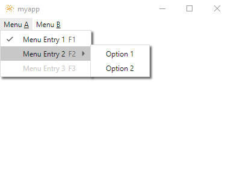
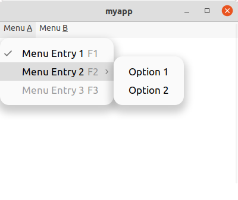

# neutralinojs-menubar

Neutralinojs is a great framework for building cross-platform applications. What it lacks, however, is a native menubar. This project aims to partly cure the disease by creating a native looking menubar using JavaScript & CSS, which gets injected behind the scenes. Partly, because this just works on Windows and Linux. At the moment I don't know of an elegant way to transfer this concept to macOS.

### Features

- Native looking menubar for Windows & Linux
- Electron Menu inspired API
- Easily customizable by simply editing the appropriate Stylesheets
- Offers a light and a dark color theme for both platforms
- Uses custom HTML elements, so it won't clash with existing Stylesheets
- Lightweight (around 19kb minified)

### Building from source

Clone the repository locally first:

`git clone https://github.com/scanline/neutralinojs-menubar`

and install the dependencies afterwards:

`cd neutralinojs-menubar`

`npm install`

Please note: This is not a npm package. Node.js tooling is just used for bundling.

After successful installation run:

`npm run build`

and the final JavaScript bundle will be at **dist/NeutralinoMenuBar.min.js**

### Getting started

First we need a neutralinojs project to work with of course. For simplicity let's take the almost empty starter template:
`neu create myapp --template neutralinojs/neutralinojs-zero`

If you've build neutralinojs-menubar from source, move dist/NeutralinoMenuBar.min.js to myapp/www or alternatively get it from [releases](https://github.com/scanline/neutralinojs-menubar/releases). 

Now open **www/index.html** in your favorite editor and locate the following line:
```html
<script src="/neutralino.js"></script>
```
right below add:
```html
<script src="/NeutralinoMenuBar.min.js"></script>
<script src="/main.js"></script>
```

**www/main.js** does not exist yet, so create it.

That's it! If you build the project using

`neu run`

you won't see too much yet though. We did not create a menu yet!

As I mentioned earlier, neutralinojs-menubar's API is loosely based on Electron's [Menu](https://www.electronjs.org/docs/latest/api/menu) and [MenuItem](https://www.electronjs.org/docs/latest/api/menu-item).

Open **www/main.js** in your editor and add:

```javascript
Neutralino.init();
Neutralino.events.on("windowClose", () => {
	Neutralino.app.exit();
});
const { Menu, MenuItem } = NeutralinoMenuBar;
```

To actually create a menu we need to utilize **Menu.buildFromTemplate()**, which takes an array of MenuItem blueprints.

```javascript
const menu = [{
	label: "Menu &A",
	submenu: [{
		label: "Menu Entry 1",
		type: "checkbox",
		checked: true,
		click: () => {
			console.log("Menu Entry 1 clicked");
		},
		accelerator: "F1"
	}, {
		label: "Menu Entry 2",
		submenu: [{
			label: "Option 1",
			click: () => {
				console.log("Option 1 clicked");
			}
		}, {
			label: "Option 2",
			click: () => {
				console.log("Option 2 clicked");
			}
		}],
		accelerator: "F2"
	}, {
		label: "Menu Entry 3",
		enabled: false,
		id: "myMenuItem",
		accelerator: "F3"
	}]
}, {
	label: "Menu &B",
	submenu: [{
		label: "Menu Entry 4",
		accelerator: "F4"
	}, {
		label: "Menu Entry 5",
		accelerator: "F5"
	}]
}];

const myMenu = Menu.buildFromTemplate(menu);
Menu.setApplicationMenu(myMenu);
```

Let's try it again! Enter:

`neu run`

and things will look a little different now.

Windows:

<kbd>  </kbd>

Linux:

<kbd>  </kbd>

Great stuff - but we can do more. If you look closely at the screenshots, you'll notice that **Menu Entry 3** is grayed-out.
If we scroll-up a bit, we'll realize that we've done this on purpose, as it's **enabled** property is set to false. What if we change our minds later on?
This MenuItem also has it's **id** property set. So all we have to do is query the menu for this particular MenuItem and set enabled to true.

```javascript
myMenu.getMenuItemById("myMenuItem").enabled = true;
```